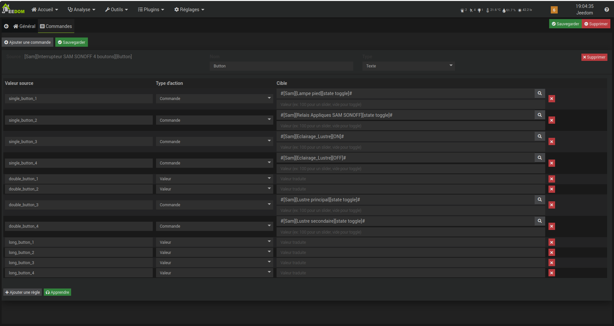

# EventTranslator — Documentation

## Présentation

EventTranslator traduit en temps réel les valeurs d'une commande info Jeedom (issue de n'importe quel plugin : Zigbee2MQTT, Z-Wave, MQTT, Virtual…) vers des actions configurables : mise à jour d'une commande info, déclenchement d'une commande action ou lancement d'un scénario.

**Cas d'usage typique :** un interrupteur Zigbee envoie des valeurs brutes (`single_left`, `double_right`, `long_left`…). EventTranslator traduit chaque valeur en une action Jeedom directement exploitable dans vos automatisations.

---

## Installation

1. Depuis le market Jeedom, rechercher **EventTranslator**
2. Installer le plugin
3. Activer le plugin dans **Plugins > Gestion des plugins**

Aucune dépendance de plugin requise.

---

## Premiers pas

### Étape 1 — Ajouter un équipement source

Ouvrir **Plugins > Programmation > EventTranslator**, puis cliquer sur **Ajouter**.

Sélectionner l'équipement Jeedom source dans la liste déroulante. Un équipement `<Nom>_et` est créé, associé à l'objet de l'équipement source.

> Chaque équipement source ne peut être associé qu'à un seul équipement EventTranslator.

### Étape 2 — Configurer l'équipement

Dans l'onglet **Général** :
- **Nom** : renommer l'équipement si nécessaire
- **Objet parent** : objet Jeedom auquel rattacher l'équipement — libre, indépendant de la source
- **Activer / Visible** : contrôle la disponibilité et l'affichage sur le dashboard

> **Convention de nommage** : le nom de l'équipement `_et` suit automatiquement celui de la source. Si la source est renommée `Interrupteur Salon`, l'équipement devient `Interrupteur Salon_et` au prochain chargement de la page. Un renommage manuel est possible à tout moment, mais sera remplacé si la source est renommée à nouveau.

### Étape 3 — Ajouter des commandes

Dans l'onglet **Commandes**, cliquer sur **Ajouter une commande** et sélectionner la commande info source à surveiller.

Renseigner :
- **Nom** : nom de la commande info qui sera produite
- **Type** : Texte, Numérique ou Binaire selon l'usage attendu

### Étape 4 — Définir les règles de traduction

Pour chaque commande, compléter le tableau des règles :

| Valeur source | Type d'action | Cible |
|---|---|---|
| Valeur brute reçue | Valeur / Commande / Scénario | Résultat attendu |

**Type Valeur** : met à jour la commande info de l'équipement `_et`. Utilisez ensuite cette commande dans vos scénarios avec `triggerValue()`.

**Type Commande** : exécute directement une commande action Jeedom (allumer une lumière, activer un équipement…).

**Type Scénario** : lance immédiatement un scénario Jeedom.

### Étape 5 — Sauvegarder

Cliquer sur **Sauvegarder**. Les listeners Jeedom sont reconstruits automatiquement.

---

## Mode apprentissage

Pour découvrir les valeurs possibles d'une commande source sans les connaître à l'avance :

1. Cliquer sur **Apprendre** (bouton vert) dans le panneau de la commande
2. Le bouton passe en rouge **Terminer (5min)**
3. Appuyer sur le bouton physique ou déclencher l'action sur l'équipement source
4. La valeur détectée apparaît automatiquement comme règle pré-remplie
5. Répéter pour toutes les valeurs souhaitées
6. Cliquer sur **Terminer** ou attendre l'expiration

Compléter ensuite le type et la cible pour chaque règle apprise, puis sauvegarder.

---

## Utilisation dans un scénario

Les commandes info de l'équipement `_et` sont utilisables comme n'importe quelle commande Jeedom.

**Exemple — déclenchement sur valeur :**
- Trigger : commande info `[Salon][Interrupteur_et][action]`
- Condition : `triggerValue() == "appui gauche"`
- Action : allumer la lampe du salon

**Remarque :** EventTranslator propage l'événement même si la valeur ne change pas (répétition d'un même appui), ce qui garantit le déclenchement à chaque pression.

---

## Exemple concret — télécommande LDESENK09 + ArmManager

### Contexte

ArmManager est un plugin Jeedom (développé par le même auteur) conçu pour regrouper différents moyens d'activer et désactiver l'alarme via le plugin **Alarme** natif de Jeedom. Il centralise les équipements de sécurité Zigbee — télécommandes et claviers — et les relie aux modes d'alarme prédéfinis.

Dans cette installation, ArmManager gère :
- une **télécommande LDESENK09** (compatible nativement, valeurs déjà au format IAS ACE)
- un **clavier DAEWOO WKE502Z** (via EventTranslator, voir ci-dessous)

Chaque bouton ou action est associé à une commande du plugin Alarme ou à un scénario :

| Action ArmManager        | Résultat dans Jeedom                        |
|--------------------------|---------------------------------------------|
| Armement total (arm_away)  | `Alarme Domicile → Mode Toutes Zones`      |
| Armement partiel (arm_home)| `Alarme Domicile → Mode Zone Ouvrants`     |
| Désarmement (disarm)       | `Alarme Domicile → Désactiver`             |
| SOS                        | Scénario `Appel Secours et Aidant`         |

> ArmManager est en cours de finalisation. Un lien vers sa documentation sera ajouté ici lors de sa publication sur le market Jeedom.

---

### Pourquoi EventTranslator est nécessaire pour le DAEWOO WKE502Z

Le DAEWOO WKE502Z envoie ses valeurs dans un format générique : `arm_away`, `arm_home`, `disarm` et `sos`.

ArmManager parle nativement le standard IAS ACE et attend : `arm_all_zones`, `arm_day_zones`, `disarm` et `panic`. Les deux vocabulaires sont incompatibles à l'état brut.

EventTranslator résout ce problème sans scénario de conversion :

1. Ajouter le DAEWOO WKE502Z comme équipement source dans EventTranslator
2. Surveiller sa commande info `action`
3. Utiliser le **mode apprentissage** pour capturer les quatre valeurs en activant chaque action sur le clavier
4. Mapper chaque valeur source vers la valeur attendue par ArmManager (type `Valeur`) :

| Valeur source (WKE502Z) | Valeur cible (ArmManager IAS ACE) |
|-------------------------|-----------------------------------|
| `arm_away`              | `arm_all_zones`                   |
| `arm_home`              | `arm_day_zones`                   |
| `disarm`                | `disarm`                          |
| `sos`                   | `panic`                           |

5. Sauvegarder — l'équipement `_et` produit désormais les valeurs dans le format natif d'ArmManager
6. Dans ArmManager, sélectionner la commande de l'équipement `_et` comme source

Le clavier est opérationnel sans modifier ni le WKE502Z, ni ArmManager, ni écrire de scénario de conversion.

---

### Au-delà de l'alarme — le cas SOS

EventTranslator ne se limite pas à la gestion d'alarme. Dans cet exemple, le bouton SOS du clavier peut être relié à un scénario Jeedom (`Appel Secours et Aidant`) plutôt qu'à une commande alarme. Ce scénario peut déclencher n'importe quelle action : appel téléphonique automatique, notification, déclenchement d'une sirène, envoi d'un SMS…

Toute commande ou scénario Jeedom peut être associé à n'importe quelle valeur source via EventTranslator.

---

## Exemple concret — interrupteur 4 boutons (simple / double / long appui)

Cet exemple illustre le cas d'usage le plus courant : un interrupteur Zigbee 4 boutons (ici un SONOFF) dont chaque bouton envoie des valeurs distinctes selon le type d'appui — simple, double ou long.

Sans EventTranslator, gérer 12 combinaisons possibles (4 boutons × 3 types d'appui) nécessite un scénario complexe avec des blocs `Si/Sinon` imbriqués. Avec EventTranslator, chaque combinaison est une ligne de règle, sans une seule ligne de code.

Dans cet exemple :

| Valeur source    | Type   | Action                              |
|------------------|--------|-------------------------------------|
| `single_button_1`| Commande | Lampe pied — toggle                |
| `single_button_2`| Commande | Appliques — toggle                 |
| `single_button_3`| Commande | Lustre — ON                        |
| `single_button_4`| Commande | Lustre — OFF                       |
| `double_button_3`| Commande | Lustre principal — toggle          |
| `double_button_4`| Commande | Lustre secondaire — toggle         |
| `long_button_*`  | Valeur   | (à configurer selon vos besoins)   |

La configuration complète tient en quelques minutes via le **mode apprentissage** : appuyer sur chaque bouton, sélectionner la commande cible — terminé.

---

## FAQ

**Plusieurs règles pour la même valeur source, est-ce possible ?**  
Oui. Vous pouvez par exemple mettre à jour une commande info ET exécuter une action sur le même `single_left`.

**L'équipement source peut-il venir de n'importe quel plugin ?**  
Oui — Zigbee2MQTT, Z-Wave JS, MQTT, Virtual, ou tout autre plugin Jeedom disposant de commandes info.

**Que se passe-t-il si l'équipement source est désactivé ?**  
Les listeners correspondants ne sont pas reconstruits et les événements ne sont pas capturés.

**Comment supprimer un équipement EventTranslator ?**  
Ouvrir l'équipement et cliquer sur **Supprimer**. Les commandes info associées sont supprimées. L'équipement source est inchangé.
